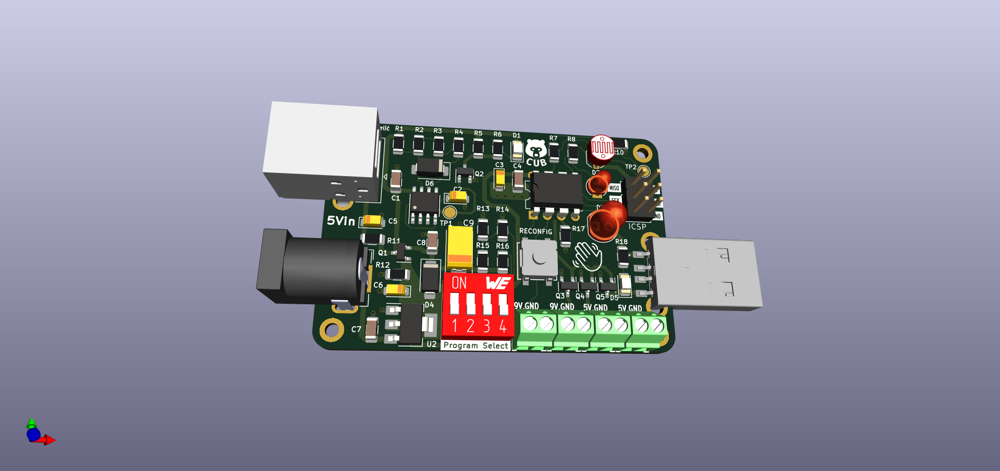
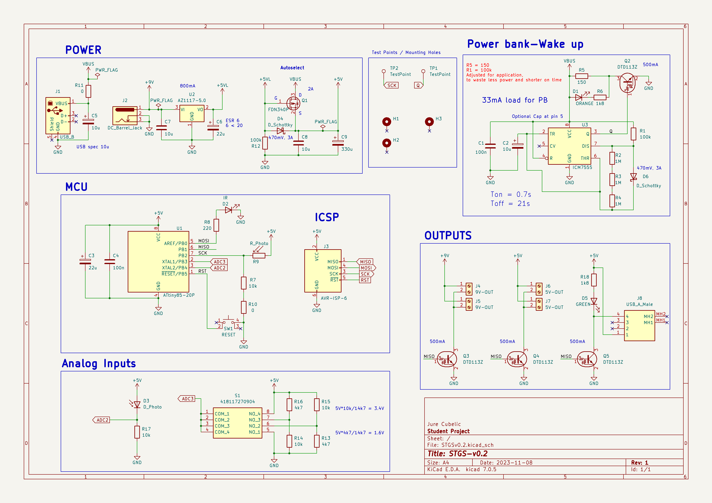

# STGS
### See-Through Glass Sensor
This repo is a work in progress.

## Power management and switching power hub 

My wish was to keep this board as reusable as possible as well as have it still flexible enough if in the future conditions where it is supposed to work change. It's safe to say I prioritized the current application for what is intended for over-reusability. The only reason this board exists is that a dear professor of mine wishes to upgrade the glass display in front of the electronics lab but the power bank that powers (currently 2) devices runs out every day and it is tedious to replace it constantly. Also having devices turned on all the time when most of the time no one is looking is unproductive. 

# Problems/Solutions
For aesthetic reasons, the requirement was for the board to be inside the glass display and no wires or parts are outside to turn on the devices. 
My solution for this was a simple yet effective combination of LDR and infra-red led & diode pair. Hence it can be triggered from outside the glass as well as benefiting the whole experience as other students can interact with the display.

The setup is currently supplied by a power bank as there are no outlets in the display. Power banks turn off after a few seconds or more up to 20-30s when not enough current is being drawn usually around 100mA but these values depend on the specific power bank. To overcome this my solution was to use ICM7555 in astable mode with a diode for a duty cycle less than 50%. As my power bank turns off at under ~30 seconds for the sake of having a safety factor the circuit is designed to give a pulse every 21s and drawing about 33mA for 0.7s and this seems to work nicely.  Of course, this feature is only active when the board is powered through USB. There is also a DC Barrel Jack I decided should be available. I thought a power management board should have at least two ways of inputting power. This way if in the future the location of the display changes and there is a wall outlet available the whole display can be powered with a 9V power adapter, as well as giving flexibility if ex. an upcoming student project that will be displayed needs more than 5V. Also, a little safety feature was added an auto selector in case someone accidentally connects both the USB and DC jack so nothing bad will happen. 

Power bank: 10,000mAh 
Average consumption: 4mA
So now instead of changing the power bank every day regardless of visitation, idealistically the power bank should be able to work 2500 hours which is around 100 days. Of course, this is without anyone passing by ever and turning it on, and nothing in the real world is ideal. 

From 1 day to 100 days is two orders of magnitude difference. As already mentioned factors, I am happy with even one order of magnitude, and in case the power bank needs to be changed every 10 days as well as provide an interactive display for visitors it is useful and beneficial. 
