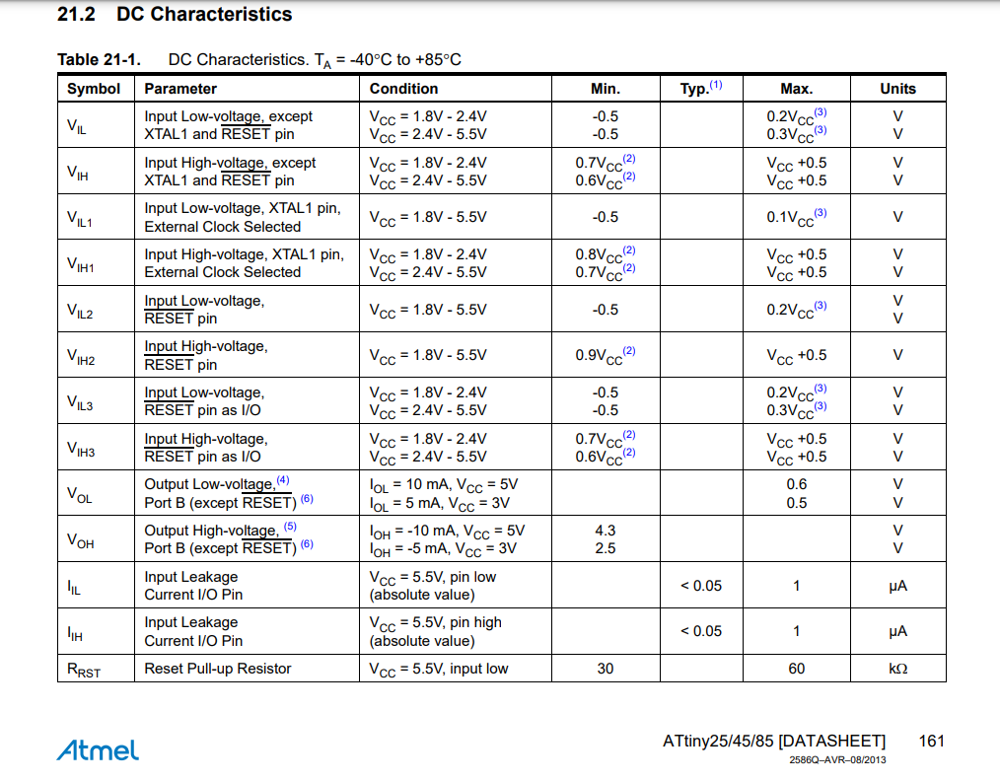

# STGS
ATtiny85 datasheet, page 161

To use external interrupt I need logic zero which is max 0.3* Vcc
Otherwise, logic 1 is min 0.6* Vcc

Photo resistor ambient resistance = 25k //arduino kit 

Dark = 150-300k 

Voltage divider rule 
R = 58k //in house 

R = 2k2 //in lab 

R = 10k // in hallway for the P_Resistor available in lab 

7.1.3 Power-down Mode

When the SM[1:0] bits are written to 10, the SLEEP instruction makes the MCU enter Power-down mode. In this
mode, the Oscillator is stopped, while the external interrupts, the USI start condition detection and the Watchdog
continue operating (if enabled). Only an External Reset, a Watchdog Reset, a Brown-out Reset, USI start condition
interupt, an external level interrupt on INT0 or a pin change interrupt can wake up the MCU. This sleep mode halts
all generated clocks, allowing operation of asynchronous modules only

Power bank Issue: 
Time before turn off 35s.
Need to draw more current so the power bank stays on.
